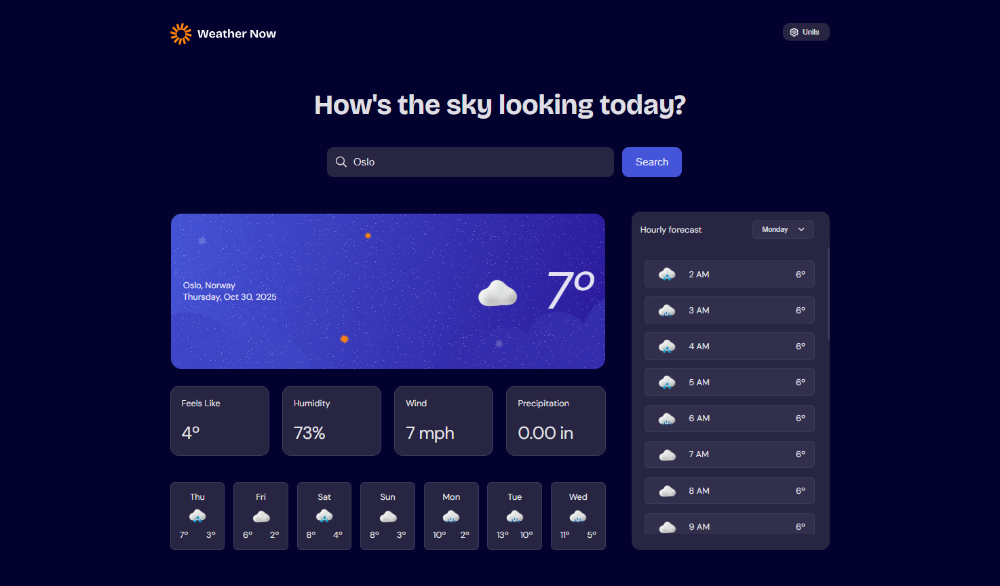

# Frontend Mentor - Weather app solution

This is a solution to the [Weather app challenge on Frontend Mentor](https://www.frontendmentor.io/challenges/weather-app-K1FhddVm49). Frontend Mentor challenges help you improve your coding skills by building realistic projects. 

## Table of contents

- [Overview](#overview)
  - [The challenge](#the-challenge)
  - [Screenshot](#screenshot)
  - [Links](#links)
- [My process](#my-process)
  - [Built with](#built-with)
  - [Useful resources](#useful-resources)
- [Author](#author)

## Overview

### The challenge

Users should be able to:

- Search for weather information by entering a location in the search bar
- View current weather conditions including temperature, weather icon, and location details
- See additional weather metrics like "feels like" temperature, humidity percentage, wind speed, and precipitation amounts
- Browse a 7-day weather forecast with daily high/low temperatures and weather icons
- View an hourly forecast showing temperature changes throughout the day
- Switch between different days of the week using the day selector in the hourly forecast section
- Toggle between Imperial and Metric measurement units via the units dropdown 
- Switch between specific temperature units (Celsius and Fahrenheit) and measurement units for wind speed (km/h and mph) and precipitation (millimeters) via the units dropdown
- View the optimal layout for the interface depending on their device's screen size
- See hover and focus states for all interactive elements on the page

### Screenshot

### Links

- GitHub URL: [https://github.com/xaoccc/Weather-app](https://github.com/xaoccc/Weather-app)
- Live Site URL: [https://vremeto.netlify.app/](https://vremeto.netlify.app/)

## My process

### Built with

- Semantic HTML5 markup
- CSS custom properties
- Flexbox
- [Svelte](https://svelte.dev/) - JS library

### Useful resources

- [Svelte](https://svelte.dev/)
- [Open Meteo](https://open-meteo.com/en/docs)
- [chatGPT](https://chatgpt.com/)
- [Netlify](https://www.netlify.com/)

### Challenges

- The dropdown menus should be select for semantics, but at the same time is impossible to customize them when they are select, so I used div, ul, li and button elements
- Getting info from the API was a challenge at the beginning, because I didn't know which parameters i needed and how to get the proper response.
- Geocoding was also a great challenge. It turns out that it is forbidden to get the geolocation on page loading without any user interactions. That is why I created the app showing the data from my hometown Sofia as default. You can easily change it to another city in App.svelte.
- The search field can work in several ways - reactive, when the search button becomes useless and the standart way, where you can search by full or partial city name. In the initial version the app was working with exact city name, which was not very convenient.

## Author

- Frontend Mentor - [@xaoccc](https://www.frontendmentor.io/profile/xaoccc)

